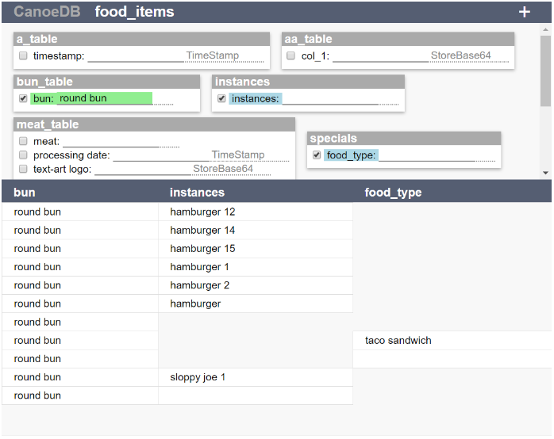

# CanoeDB  
#### A simple relational NoSQL database on the front-end, and just a directory of CSV files on the back-end. 
 
 
* **Relational:** CSV files become tables with relationships to other tables  
* **Auto-dereferencing:** queries that span multiple tables are dereferenced automatically (and any tables in between)
* **Simple Referencing:** left column is always the reference ID  
* **Simple configuration:** first three lines in CSV file:  
<table>
	<tr>
		<th></th>
		<th>Column Title 1</th>
		<th>Column Title 2</th>
	</tr>
	<tr>
		<th></th>
		<th></th>
		<th>A Different Table</th>
	</tr>
	<tr>
		<th></th>
		<th>TimeStamp</th>
		<th></th>
	</tr>
	<tr>
		<td>1</td>
		<td>data 1</td>
		<td>data 2</td>
	</tr>
	<tr>
		<td>2</td>
		<td>data a</td>
		<td>data b</td>
	</tr>
	<tr>
		<td>custom id</td>
		<td>data AA</td>
		<td>data BB</td>
	</tr>
</table>

* **In-Memory (IMDB):** In the 64-bit age, cost rather than address space typically limits memory capacity.  If the growth of your data set is roughly proportional to the size of your organization and volume of RAM you can afford, then in-memory is practical and beneficial.  See [Wikipedia article on in-memory databases](https://en.wikipedia.org/wiki/In-memory_database)
* **High Survivability:** data is *appended* to CSV files (O_APPEND) and cannot be deleted.  Rather than deleting, *Transform* modifiers such as *Last* (See [API](#API)) can be used to return the latest data written.  The APPEND operation (POSIX) is by definition a safe and atomic file operation.  If redunancy and backups are desired, it's just matter of periodically copying CSV files in the database folder.
* **High Performance:** The latency of a read-only query is simply the time necessary to traverse the hash-based memory structure. The latency of a write (read-write) query is the time required to complete a file APPEND operation (if an identical table-row doesn't already exist) on each table-file the query (directly or indirectly) touches, plus the follow-on read-only query.

# SPA Interface  
 


# HTTP API  
*The Webserver layer*
## GET & POST Requests
Commands can be added in any order as the REST path.
#### GET Example:
`http://localhost:8080/command[/another-command][/third-command]?table.column[.Transform]=some+text`
#### POST Example:
`http://localhost:8080/command[/another-command][/third-command]`
**BODY:** `table.column[.Transform]=some+text`
## Commands
#### Data Type Returned
- json
```json
{
	"name" : "database folder name",
	"structure" : {
		"Table 1" : {
			"Column 1" : {
				"transform" : "TimeStamp"
			},
			"Column 2" : {
				"reference" : "Table 2"
			}
		}
	},
	"columns" : {},
	"rows" : {}
}
```
- csv
- form (default)
#### R/W Mode
- read (default)
- write (performs a write and then a read)
#### Logic Mode
- and (default)
- or
- xor
#### Nulls Allowed
- nonulls (default)
- nulls (allows rows to be returned containing nulls)
#### Example:
```
http://localhost:8080/json
http://localhost:8080/json/xor
http://localhost:8080/json/or/write
http://localhost:8080/form
http://localhost:8080/csv/write
http://localhost:8080/spa
```

## Transforms:
- A transform object is applied to the set of results returned by the filter-text.  The transform is not used for anything if filter-text is not supplied.  (Note: filter-text is what is written in a write operation.)
- Each Transform is simply the name of a Java Class located in the sub-package: `io.github.gabrielwilson3.canoedb.transforms`
Transform objects extend the base *Transform* object, and are dynamically loaded at runtime.
- When a table (CSV file) is loaded, the third line of the CSV file contains Transform names, which CanoeDB attempts to load.
- If a Transform that is called out in a table file or by an HTTP query cannot be loaded, the base Transform object will be used instead.  The base Transform object makes no changes to the data being read or written.
#### Example:
`http://localhost:8080/json?table.column.Last=some+filter+text`
#### Transforms Currently Supported:
- Last
  - The query element table1.column1.Last=something will allow only the last (latest) tale-row object to be returned from "table1".  This does not necessarily mean the combined set of data returned from the overall query is limited to one row. 
- First
  - Similar to First, but first (earliest) row is returned.
- TimeStamp
  - On a write operation, entering "auto" as the filter returns the current date/time.
- StoreBase64
  - Stores data as Base64 in the CSV file.  Data is sent both directions as plain (URI-encoded) UTF-8.
- TransmitBase64
  - Data sent in both directions is encoded as Base64, but stored in the CSV file as plain UTF-8.
	
  
# Architecture  


  
# Rationale for Reinvention of a Wheel:  
- SQL syntax might be considered *declarative* for simple-use cases, but in traversing reference chains across the chasms between distantly related tables, SQL is painfully *imperative*.  
- CanoeDB is the fusion of a declarative microservice API layer with a table-structure traversal algorithm.  
  
## Tree-Structure vs. Related Tables:  
- Tree-like data structures are wonderful (e.g. JSON), but they aren’t always a silver bullet when it comes to overly intertwined and tangled data.  
- Example: the following describes a tree model with some departmental roles:  

```  
 Department         Employee        Role  

 Engineering ---+-> Manager ------> Drinks_coffee 
                |  
                +-> Engineer1 ----> Builds_stuff
                |  
                +-> Engineer2 ----> Builds_stuff
```

- This looks great, until the VP tells you he wants to see the hierarchy by `Role -> Employee -> Department`
Or worse, `Employee -> Department -> Role` Or both.  And he wants the Night Watchman added.

``` 
 Role                Employee           Department  
 
 Builds_stuff ---+-> Engineer1 -------> Engineering
                 | 
                 +-> Engineer2 -------> Engineering
		 
                                        
 Drinks_coffee --+-> Manager ---------> Engineering
                 | 
                 +-> Night_Watchman --> Engineering
```  

- Behind the scenes, every tree or object structure is ultimately described with primitive tables of references (sometimes explicitly and sometimes implicitly).  

```  
    +-------------+      +----------+      +-------------------------+  
    |Role         |      |Department|      |Employee      |Dept.|Role|  
+-----------------+  +--------------+  +-----------------------------+  
| 0 |Builds stuff |  | 0 |Enginering|  | 0 |Manager       |  0  | 1  |  
+-----------------+  +--------------+  +-----------------------------+  
| 1 |Drinks coffee|                    | 1 |Engineer1     |  0  | 0  |  
+-----------------+                    +-----------------------------+  
                                       | 2 |Engineer2     |  0  | 0  |  
                                       +-----------------------------+  
                                       | 3 |Night Watchman|  0  | 1  |  
                                       +-----------------------------+  
```  

- When you decompose a tree into tables with references, you’ll see there are end-node tables (e.g. Role & Department) and linking tables (e.g. Employee).  Technically, Employee could be an end-node table, a fourth table could link; but since the Employee table corresponds 1:1 with the linking table (in this case), we’ll just use the Employee table as the linking table.  
- What we’ve effectively accomplished is that we’ve decompiled the tree structure down into its table description.  
- We can now start at any one of the elemental tables and now build a tree-structure as we jump from table to table following references.  
  
## How Do You Want to Store Data?  
- In some cases you may want to store data pre-structured into a tree.  If you know beforehand how data will be structured, and if that structure will not change often, then a tree may be the ideal way to store data.   
- If, on the other hand, you want maintain flexibility in how the data will ultimately be structured, or if you will often need to change that structure, then storing data in its elemental related tables may be instead ideal.  
- Relational databases store data in elemental tables, while document databases (e.g. MongoDB) store data in tree-like (JSON/BSON) structures (i.e. documents).  It’s possible to add intertwining and merging (as opposed to branching) links between nodes in tree structures, and this is ideal in some situations, but the complexity of the tree-structure will significantly increase.  
  
  
  
  
# Answers to Life's Questions:
[everystudent.com](https://www.everystudent.com/)
